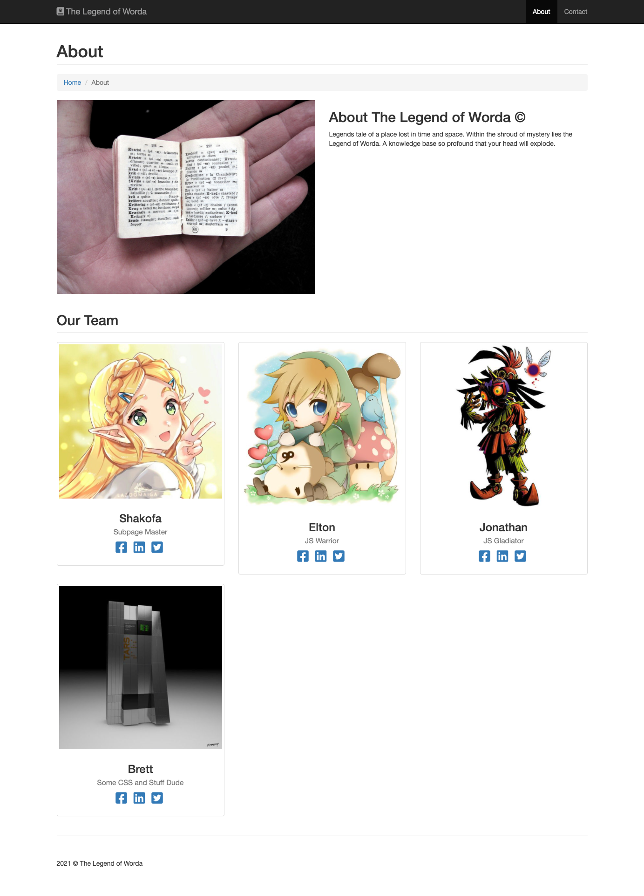

# The Legend of Worda 

## Info
The legend of Worda is a simple dictionary search.
There contains three containers that displays random words according to the specified etymology posted above. 
There are a couple of 'keywords' that can be searched and they will bring up custom background pics. These words include: link, hero, dog, cat, shield, sword, owl, ocarina, horse, tunic and legend. There is a contact page used to contact the creators of the page and also an about page that talks about the page and its creators.

## Links
[Link to github](https://github.com/sksmejn/word-force)
[link to Webpage](https://sksmejn.github.io/word-force/)

## Tools and technologies
- Languages: HTML, CSS, JS
- API: Merriam-Webster Dictionary API
- Secondary API: Merriam-Webster Thesaurus API
- Libraries: jQuery, Boostrap, FontAwesome

## Screenshots

